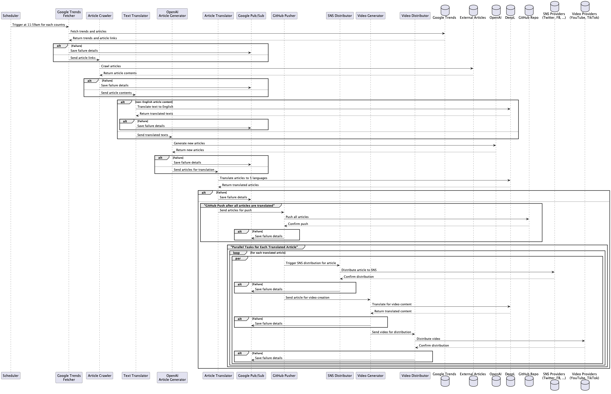
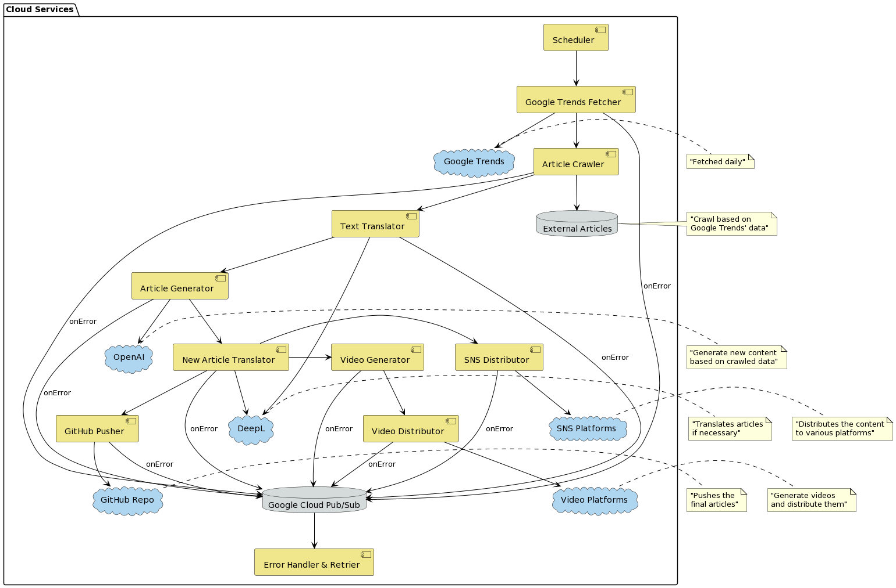

# `wikitoday.io` server
> for making ai news using the LLM model


<p align="center">

<br/>
<br/>

<hr />

</p>

# 1. v2 seq(EN)
> Business Model Implementation Using Google Cloud Services

## Overview

In this system, we will leverage Google Cloud Run job, Google Cloud Workflows, Google Cloud Pub/Sub, and Google Cloud Scheduler to implement a business model that generates articles based on trending search terms from Google Trends. The entire process will be designed to run efficiently and effectively in a production environment.

## Workflow Steps

### 0. Schedule Trigger
- A cron job is set to run daily at 11:59 AM for each country.

### 1. Fetch Trending Keywords and Article Links
- Receive the country code.
- Fetch today's trending search keywords and related article links (2 articles per keyword, around 5 keywords) using APIs.
- Publish the fetched data to a Pub/Sub topic.

### 2. Article Crawling and Data Extraction
- Subscribe to the Pub/Sub topic.
- Crawl the provided article links to extract text and images.
- Publish the extracted data to another Pub/Sub topic.

### 3. Language Translation (Optional)
- Subscribe to the Pub/Sub topic.
- If the extracted text is not in English, translate it to English using a translation service.
- Publish the translated data to another Pub/Sub topic.

### 4. Generate New Articles with OpenAI
- Subscribe to the Pub/Sub topic.
- Process each set of articles and related prompts.
- Send requests to OpenAI's API to generate new articles using GPT-3.5.
- Publish the generated articles to another Pub/Sub topic.

### 5. Translation with DeepL
- Subscribe to the Pub/Sub topic.
- Process each generated article.
- Send requests to DeepL's API for translation into multiple languages.
- Publish the translated articles to another Pub/Sub topic.

### 6. Push Translated Articles to GitHub
- Subscribe to the Pub/Sub topic.
- Receive the translated articles and push them to a GitHub repository using the GitHub API.

### 7. SNS Marketing
- Subscribe to the Pub/Sub topic.
- Process the translated articles.
- Send posts to social media platforms (Twitter, Yandex Dzen, Instagram, Facebook) using their respective APIs.

### 8. Create Short Videos (Continued)
- Subscribe to the Pub/Sub topic.
- Create short videos (40-60 seconds) based on article content and images.
- Push the videos to YouTube, TikTok, and Instagram Reels using their APIs.

### 9. Push Short Videos 
- Subscribe to the Pub/Sub topic.
- Push the short videos created in step 9-1 to YouTube, TikTok, and Instagram Reels using their APIs.

## Error Handling and Retries

- For tasks that fail in the middle, store relevant information in each step so that tasks can be retried when errors are resolved.

## Conclusion

By employing Google Cloud Run job, Google Cloud Workflows, Google Cloud Pub/Sub, and Google Cloud Scheduler, this system will efficiently generate articles and videos based on trending search terms, and distribute them to various social media platforms.


# 2. v2 seq(KO)
> Google Cloud 서비스를 활용한 비즈니스 모델 구현

## 개요

이 시스템에서는 Google Cloud Run job, Google Cloud Workflows, Google Cloud Pub/Sub, 그리고 Google Cloud Scheduler를 활용하여 Google Trends의 트렌디한 검색어를 기반으로 기사를 생성하는 비즈니스 모델을 구현합니다. 전체 프로세스는 실제 제품 환경에서 효율적으로 동작하도록 설계됩니다.

## 워크플로우 단계

### 0. 일정 시간에 크론 작업 실행
- 각 국가별로 매일 오전 11시 59분에 크론 작업이 실행됩니다.

### 1. 트렌딩 키워드 및 기사 링크 가져오기
- 국가 코드를 받습니다.
- API를 사용하여 오늘의 트렌딩 검색어와 관련 기사 링크 (키워드당 2개의 기사, 대략 5개의 키워드)를 가져옵니다.
- 가져온 데이터를 Pub/Sub 주제에 발행합니다.

### 2. 기사 크롤링 및 데이터 추출
- Pub/Sub 주제를 구독합니다.
- 제공된 기사 링크를 크롤링하여 텍스트와 이미지를 추출합니다.
- 추출된 데이터를 다른 Pub/Sub 주제에 발행합니다.

### 3. 언어 번역 (선택 사항)
- Pub/Sub 주제를 구독합니다.
- 추출된 텍스트가 영어가 아닌 경우, 번역 서비스를 사용하여 영어로 번역합니다.
- 번역된 데이터를 다른 Pub/Sub 주제에 발행합니다.

### 4. OpenAI를 사용하여 새로운 기사 생성
- Pub/Sub 주제를 구독합니다.
- 각 기사와 관련 프롬프트를 처리합니다.
- OpenAI의 API에 요청을 보내어 GPT-3.5를 사용하여 새로운 기사를 생성합니다.
- 생성된 기사를 다른 Pub/Sub 주제에 발행합니다.

### 5. DeepL을 사용한 번역
- Pub/Sub 주제를 구독합니다.
- 각 생성된 기사를 처리합니다.
- 여러 언어로 번역하기 위해 DeepL의 API에 요청을 보냅니다.
- 번역된 기사를 다른 Pub/Sub 주제에 발행합니다.

### 6. 번역된 기사 GitHub에 푸시
- Pub/Sub 주제를 구독합니다.
- 번역된 기사를 받아와 GitHub API를 사용하여 GitHub 리포지토리에 푸시합니다.

### 7. SNS 마케팅
- Pub/Sub 주제를 구독합니다.
- 번역된 기사를 처리합니다.
- 각 소셜 미디어 플랫폼 (Twitter, Yandex Dzen, Instagram, Facebook)의 API를 사용하여 게시물을 작성합니다.

### 8. 짧은 영상 생성 (9에서 계속)
- Pub/Sub 주제를 구독합니다.
- 기사 내용과 이미지를 기반으로 짧은 영상 (40~60초)을 생성합니다.
- 생성된 영상을 YouTube, TikTok, Instagram Reels에 푸시합니다.

### 9. 짧은 영상 푸시
- Pub/Sub 주제를 구독합니다.
- 단계 9-1에서 생성한 짧은 영상을 YouTube, TikTok, Instagram Reels에 푸시합니다.

## 에러 처리와 재시도

- 중간에 실패한 작업들은 해당 단계의 정보를 저장하여 문제가 해결될 경우 재시도할 수 있도록 합니다.

## 결론

Google Cloud Run job, Google Cloud Workflows, Google Cloud Pub/Sub, 그리고 Google Cloud Scheduler를 활용하여 이 시스템은 트렌딩 검색어를 기반으로 기사와 영상을 효율적으로 생성하고 다양한 소셜 미디어 플랫폼에 배포합니다.

# ~~v1 seq(Deprecated)~~

Below is the server architecture I envisioned for making ai news using the LLM model.

1. Cronjob
2. Data Source server
  1. Get ranked link from 3rd party list posts api (i.e google trends api, youtube realtime, hot tweets, hot facebook posts)
  2. Pass to crawler
  3. Crawl links
    - crawl images and text contents
  2-4. Pass it to `AI server`
1. AI server(Regenerate contents)
  1. pass crawled data to `llm`( i.e gpt4-api or bard api) with prompt
  2. prompt details
    1. seo (english)
      1. title
      2. description
      3. keywords
      4. canonical path name
    2. contents (english)
      1. summary in line
      2. 6~8 group of Q&A 
      3. regenerated article
  3. Save contents as a `<article>.md`
2. Translate `<article>.md` to other languages (5 ~ 10 languages)
3. Push it to news frontend github repository
4. CI/CD trigger
5. Build
6. Deploy with cloud flare pages

## arch
- [mongo](https://chat.openai.com/c/ceecbe13-bf65-4dab-96df-42b66a87fc08)
  - [atlas](https://cloud.mongodb.com/v2/64bf6da368f1a3195493f775#/clusters/starterTemplates)
- [google trends](https://github.com/deedy5/google_trends)
- [crawl and parse text](https://chat.openai.com/c/849ac652-e1cd-4672-ba6e-f2468ce5c9d7)
- llm server
  - crawler
  - parse text
  - regenerator


## init

```sh
> poetry init
> pyenv local 3.11
> poetry env use $(pyenv which python)
> poetry env info
> poetry add scrapy fastapi 'uvicorn[standard]' httpx
```

- [m1 clang with lxml error](https://github.com/lxml/lxml/pull/360)
